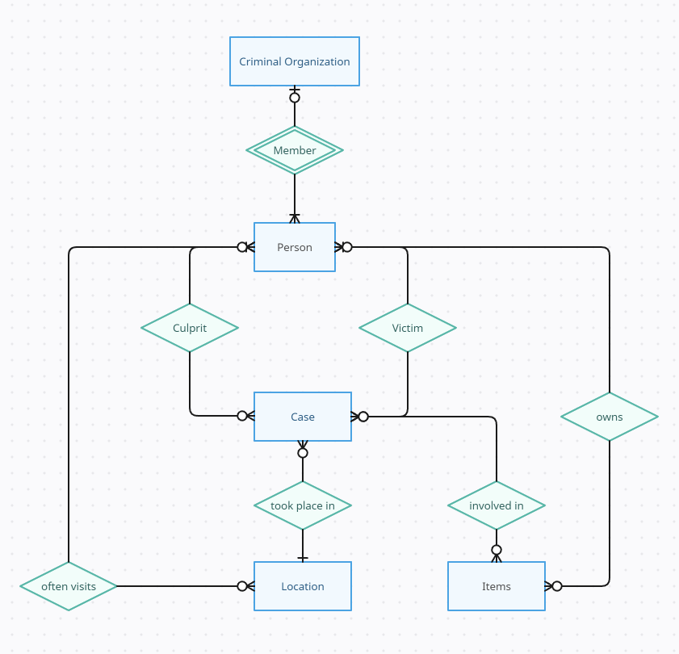

# SQL Challenge

## Database model notes

### ER diagram

The following diagram represents main entities that will be needed in this challenge, as well as the relationships between them.

Main entities (shown as blue rectangles in the diagram) will all be represented as new tables in the final DB. Columns that could be included in those tables is attached below:

| Entity | Required fields |
| --- | --- |
| Criminal Organization | `id`, `name`, `is_active`, `creation_date` |
| Person | `id`, `name`, `age`, `gender`, `occupation`, `physical_attributes`, `personality_traits` |
| Case | `type`, `creation_date`, `resolution_date` |
| Location | `name`, `coordinates` |
| Items | `type`, `name` |

Green items in the diagram represent relationships, which in some cases will be translated to intermediate tables. Details on these relationships and their cardinalities is included below:

| Relationship | Cardinality | Description | Required fields* |
| --- | --- | --- | --- |
| Member | 0-1:N | Represents that a person belongs to an organization at the most, while an organization can contain many members | (No intermediate table needed, as we're limiting people to be in one organization at the most) |
| Culprit | N:N | Represents that a person was the culprit in zero or more cases, and also that there can be multiple culprits involved on a single case | `person_id`, `case_id` |
| Victim | N:N | Represents that a person was a victim in zero or more cases, and also that there can be multiple victims involved on a single case | `person_id`, `case_id` |
| Often visits | N:N | Represents that a person often visits one or more specific locations, while said locations can be frequently visited by many people | `person_id`, `location_id` |
| Involved in | N:N | Represents that one or more items were found in the crime scene, whereas same item can be involved in different cases | `item_id`, `case_id` |
| Owns | N:N | Represents that a person owns one or more items, whereas multiple people can own copies of the same item | `person_id`, `item_id` |
| Knows | N:N | Represents that a person can have a relationship with one or more people | `person_id`, `other_person_id`, `type` |

(*) Required fields are specified for relationships that will be represented in DB with intermediate tables.
